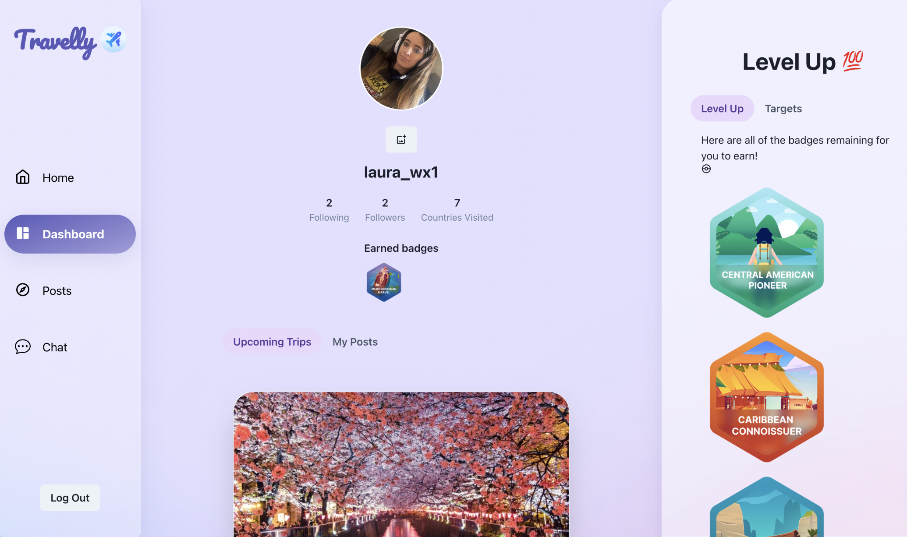

# Travelly

## Description

Travelly is a trip finder application fused together with a social network functionality. We have gamified the travel experience. Travel the world and earn unique badges. Our smart technology will learn your travel goals and display trips that you will love.

Travelly acts as a social media and advertising platform, providing gap-year style travel companies a place to advertise their trips using an admin account, and allow users to join the trips and interact with other travellers prior to travelling. Travelly also provides a user-achievement system, allowing users to earn badges based on what trips they have been on and the countries each trips visits.

## Contributors

- [Bav Kudhail](https://github.com/BavKudhail)
- [Grant Tolhurst](https://github.com/GrantRT)
- [Laura Walters](https://github.com/laurawalters1)

## Technologies Used:

- Html
- CSS
- Javascript
- NodeJS
- Express
- AWS S3 bucket
- Socket IO
- Chakra UI
- React
- GraphQL
- MongoDB Atlas
- Mongoose

## Deployed Application:

[Travelly App](https://gentle-lowlands-70428.herokuapp.com/)
